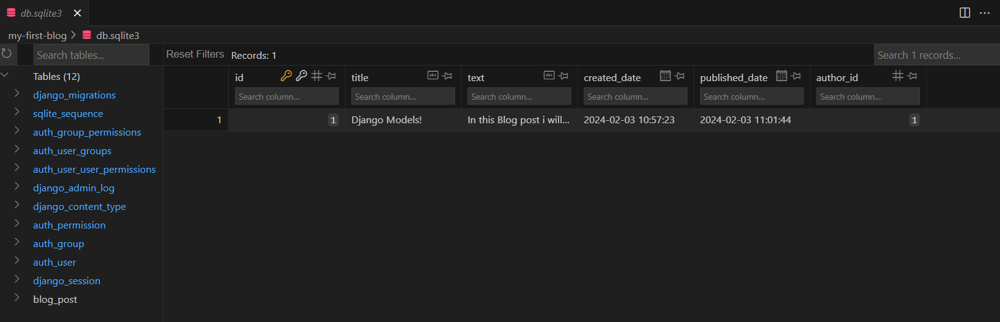
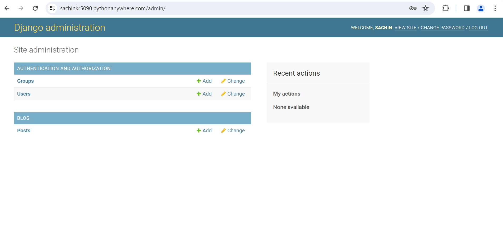

# First Django Project

This project is for understanding how Django project and app is created.

It makes us understand that when we create a Model it creates a table in DB with this name "project_model"


## Lets get Started.

Create Virtual Environment and activate it.

```
python -m venv venv

venv/Scripts/active
```


### Create Skeleton of Django Project (mysite).

```
django-admin startproject mysite .
```

To configure the project, we have made changes to below properties in mysite/settings.py file.

```
TIME_ZONE = 'Asia/Kolkata'

STATIC_ROOT = BASE_DIR / 'static'

ALLOWED_HOSTS = ['127.0.0.1','.pythonanywhere.com']
```

Create secret and Copy it to an .env file with name as SECRET='<Secret_Value>'

```
python -c 'from django.core.management.utils import get_random_secret_key; print(get_random_secret_key())'
```

We are using here default sqlite3 DB, so no changes required here.

Start the web server.

```
python manage.py runserver
```


### Create an App (blog) inside the project for creating Models.

```
python manage.py startapp blog
```

For Project to know about this app, add this to mysite/settings.py

```
INSTALLED_APPS = [
    ... # deafault values
    'blog',
]
```


#### Create a Model for blog post at blog/models.py

The Post model will create a DB table with the fields. 
The author field will be a ForeignKey to another Model. If the Author is removed it's blogs will also be removed.
It is a one-to-many relationship.

Create migration files

```
python manage.py makemigrations blog
```

Apply the migration files to our DB (db.sqlite)

```
python manage.py migrate blog
```

In DB you can see a table named 'blog_post' with the fields added.


#### Django Admin

We will use this to add and delete posts.

In blog/admin.py we have registered our model to make it visible on admin page.


#### Create Super User

A super user is an account that has control over everything on the site.

```
python manage.py createsuperuser
```

This will add user created in DB table named 'auth_user'


### Interacting with the Website.

Navigate to 127.0.0.1:8000/admin/

Post -> Create Post , Delete post ... etc.

once you have added the Post content. You can view it in the DB as well.




## Deploying this project on PythonAnywhere

Login and create the API Token from Accout tab.

From PythonAnywhere Dashboard go to console and select bash. Run below commands.

> [!CAUTION]
> Please move the selected project to home directory. Else below script will fail.

```
pip3.8 install --user pythonanywhere
pa_autoconfigure_django.py --python=3.8 https://github.com/sachinkr5090/Django-Projects.git
```

Create Super User for Django Admin from the bash terminal.

```
python manage.py createsuperuser
```


Our site is live [Create Blog Posts](https://sachinkr5090.pythonanywhere.com/admin)


